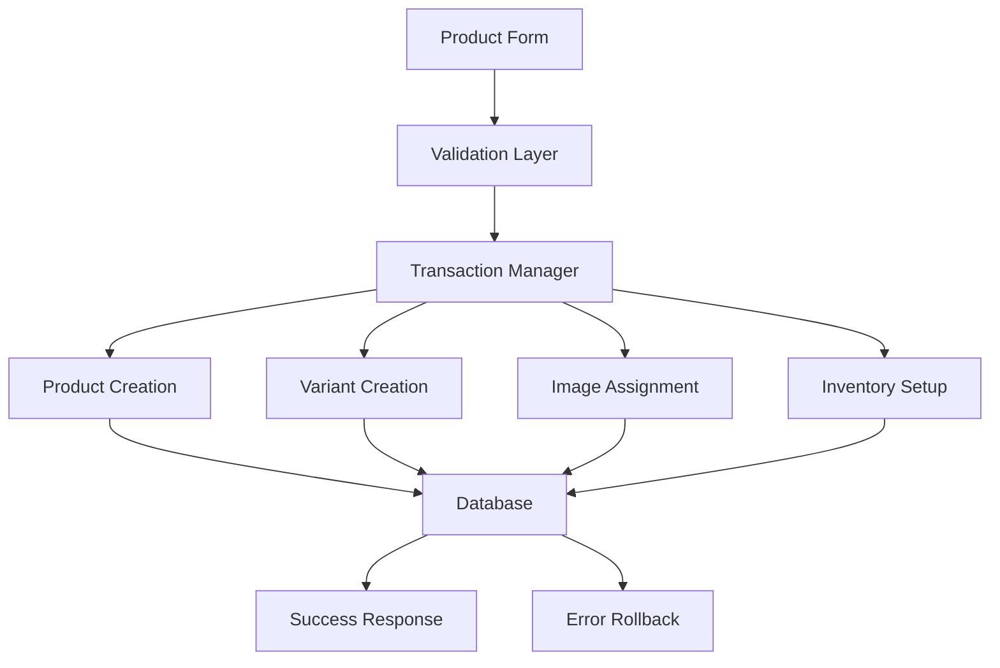

# Modern E-commerce UI Architecture Guide

## Overview

This document outlines the modern, industry-standard e-commerce admin UI architecture implemented for product creation and management. The design prioritizes user experience, data consistency, and operational efficiency.

## Core Architecture Principles

### 1. **Unified Product Creation Flow** ✅

**Why Unified?**
- **Industry Standard**: Modern e-commerce platforms (Shopify, WooCommerce, Magento) use unified product creation
- **Reduced Cognitive Load**: Users don't need to context-switch between different screens
- **Data Consistency**: All related data is created in a single transaction
- **Better UX**: Immediate feedback and validation across all product aspects

**What's Unified:**
```
Product Creation = Basic Info + Variants + Images + Inventory
```

### 2. **Multi-Step Progressive Disclosure**

**Step Structure:**
1. **Basic Info** - Core product details
2. **Variants & Pricing** - Color/size combinations with pricing
3. **Images & Media** - Visual assets with variant assignment
4. **Inventory & Stock** - Stock management and tracking

**Benefits:**
- Reduces overwhelming forms
- Allows users to focus on one aspect at a time
- Provides clear progress indication
- Enables partial saves and validation

### 3. **Real-time Variant Management**

**Features:**
- **Auto-SKU Generation**: Automatically creates SKUs based on product name, color, and size
- **Dynamic Pricing**: Supports both regular and sale pricing per variant
- **Color/Size Matrix**: Visual representation of all variant combinations
- **Inventory Tracking**: Real-time stock levels per variant

## Module Architecture Decisions

### ✅ **What Should Be Combined**

#### 1. Product + Variant Management
```typescript
// BEFORE: Separate flows
/dashboard/products/new          // Just basic product info
/dashboard/products/variants/new // Separate variant creation

// AFTER: Unified flow
/dashboard/products/new          // Complete product with variants
```

**Reasoning:**
- Variants are meaningless without a product
- E-commerce requires variants for inventory management
- Users expect to define variants during product creation
- Prevents orphaned data and incomplete products

#### 2. Image Upload + Variant Assignment
```typescript
interface ImageWithVariantAssignment {
  id: string;
  url: string;
  variantId: string | null;  // Can be assigned to specific variant
  isPrimary: boolean;
  sortOrder: number;
}
```

**Reasoning:**
- Modern e-commerce shows variant-specific images
- Users expect to see different images for different colors
- Improves customer experience on storefront
- Industry standard (Amazon, eBay, Shopify all do this)

#### 3. Pricing + Inventory Management
```typescript
interface VariantWithInventory {
  sku: string;
  price: string;
  salePrice?: string;
  inStock: number;        // Immediate inventory tracking
  lowStockThreshold?: number;
}
```

**Reasoning:**
- Pricing and inventory are tightly coupled
- Real-time stock visibility prevents overselling
- Enables immediate business decisions
- Supports inventory alerts and automation

### ✅ **What Should Remain Separate**

#### 1. Attribute Management (Colors, Sizes)
```
/dashboard/attributes/colors     // Global color management
/dashboard/attributes/sizes      // Global size management
```

**Reasoning:**
- **Reusability**: Colors and sizes are used across multiple products
- **Consistency**: Ensures brand consistency across product catalog
- **Efficiency**: Bulk management of attributes
- **Data Integrity**: Single source of truth for attributes

#### 2. Brand/Category Management
```
/dashboard/brands               // Brand management
/dashboard/categories          // Category hierarchy
```

**Reasoning:**
- **Hierarchical Data**: Categories have parent-child relationships
- **Global Impact**: Changes affect multiple products
- **Different Permissions**: Different users may manage these
- **SEO Impact**: URL structures depend on these hierarchies

#### 3. Media Library
```
/dashboard/media               // Global asset management
```

**Reasoning:**
- **Asset Reuse**: Images may be used across multiple products
- **Storage Management**: Centralized file management
- **Performance**: CDN integration and optimization
- **Organization**: Folder structures and tagging

## Technical Implementation

### 1. **Transaction-Based Data Creation**

```typescript
// All related data created in single transaction
await db.transaction(async (tx) => {
  const product = await tx.insert(products).values(productData);
  const variants = await tx.insert(productVariants).values(variantsData);
  const images = await tx.insert(productImages).values(imagesData);
  
  // Ensures data consistency - all or nothing
});
```

### 2. **Real-time Validation**

```typescript
// Progressive validation per step
const isStepValid = {
  basic: name.length > 0 && description.length >= 10,
  variants: variants.length > 0 && allVariantsValid,
  images: images.length > 0,
  inventory: allVariantsHaveStock
};
```

### 3. **Optimistic UI Updates**

```typescript
// Immediate feedback before server confirmation
const handleVariantAdd = () => {
  // Update UI immediately
  setVariants([...variants, newVariant]);
  
  // Auto-generate SKU
  const sku = generateSKU(newVariant);
  updateVariant(index, 'sku', sku);
};
```

## User Experience Benefits

### 1. **Reduced Time to Market**
- Complete product setup in single session
- No need to remember to create variants later
- Immediate inventory setup

### 2. **Error Prevention**
- Real-time validation prevents data issues
- SKU conflict detection
- Required field validation per step

### 3. **Visual Feedback**
- Progress indicators show completion status
- Color swatches and size badges for easy identification
- Image previews with variant assignments

### 4. **Mobile Responsive**
- Collapsible sections for mobile use
- Touch-friendly controls
- Responsive grid layouts

## Comparison with Industry Standards

### Shopify Admin
✅ **Similar Approach:**
- Unified product creation
- Variant management in same flow
- Image assignment to variants
- Real-time inventory tracking

### WooCommerce
✅ **Similar Approach:**
- Product variations in same interface
- Attribute-based variants
- Stock management per variation

### Magento Commerce
✅ **Similar Approach:**
- Configurable products with variants
- Attribute sets for product types
- Media gallery with variant assignment

## Data Flow Architecture



## Performance Considerations

### 1. **Lazy Loading**
- Load dropdown data on demand
- Image optimization and lazy loading
- Pagination for large datasets

### 2. **Caching Strategy**
- Cache attribute data (colors, sizes)
- Cache brand/category hierarchies
- Invalidate cache on updates

### 3. **Database Optimization**
- Indexed foreign keys
- Optimized queries for product listings
- Batch operations for bulk updates

## Future Enhancements

### 1. **Advanced Features**
- Bulk product import/export
- Product templates for quick creation
- AI-powered SKU generation
- Automated image optimization

### 2. **Integration Capabilities**
- Third-party inventory systems
- Marketplace synchronization (Amazon, eBay)
- ERP system integration
- Analytics and reporting

### 3. **User Experience**
- Drag-and-drop variant reordering
- Bulk variant operations
- Advanced search and filtering
- Keyboard shortcuts for power users

## Conclusion

This modern e-commerce UI architecture provides:

1. **Streamlined Workflow**: Single-session product creation
2. **Data Consistency**: Transaction-based operations
3. **Industry Alignment**: Follows established e-commerce patterns
4. **Scalability**: Modular architecture for future growth
5. **User-Centric Design**: Intuitive and efficient interface

The architecture balances comprehensive functionality with ease of use, ensuring that product creation is both powerful and accessible for administrators of all technical levels.
